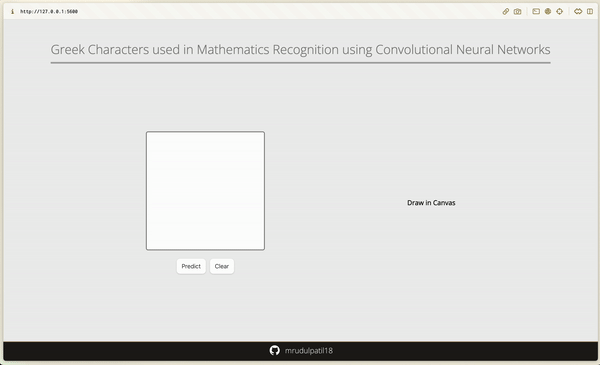

# GreekGlyphScribe

Math Symbol Identifier is a Deep Learning (DL) project designed to assist students in learning new mathematical symbols. When students encounter unfamiliar Greek symbols in their mathematical studies, they can visit this website, draw the symbol on the canvas, and receive basic information about the symbol, predicted by a Convolutional Neural Network (CNN) model.

## Installation


1. **Clone the Repository**

   ```bash
   git clone https://github.com/mrudulpatil18/greekGlyphScribe.git
   ```

2. **Navigate to the Project Directory**

   ```bash
   cd greekGlyphScribe
   ```

3. **Install Dependencies**

   ```bash
   pip install -r requirements.txt
   ```

4. **Run the Web Application**

   ```bash
   python app.py
   ```

5. **Access the Website**

   Open a web browser and go to `http://localhost:5600` to use the Math Symbol Identifier.

## Usage



## Model Training

[Jupyter Notebook](Classification.ipynb)

## Contributing

Pull requests are welcome. For major changes, please open an issue first
to discuss what you would like to change.

## License

[MIT](https://choosealicense.com/licenses/mit/)

## Authors

- [@mrudulpatil18](https://www.github.com/mrudulpatil18)

